# Banff & Jasper Road Trip — Itinerary App

> **Archived.** This trip (Sept 2–10, 2026) is complete. The app is kept as a public demo / reference for a small offline-capable itinerary PWA.

A single-page, installable, offline-capable itinerary for a Banff & Jasper road trip — swipeable day plans, packing list, satellite map, and optional shared sync via a tiny Node API.

## Screenshots

### Day view (swipeable itinerary)

| Sep 2 · Travel | Sep 3 · Mountains | Sep 4 · Lakes |
| --- | --- | --- |
| 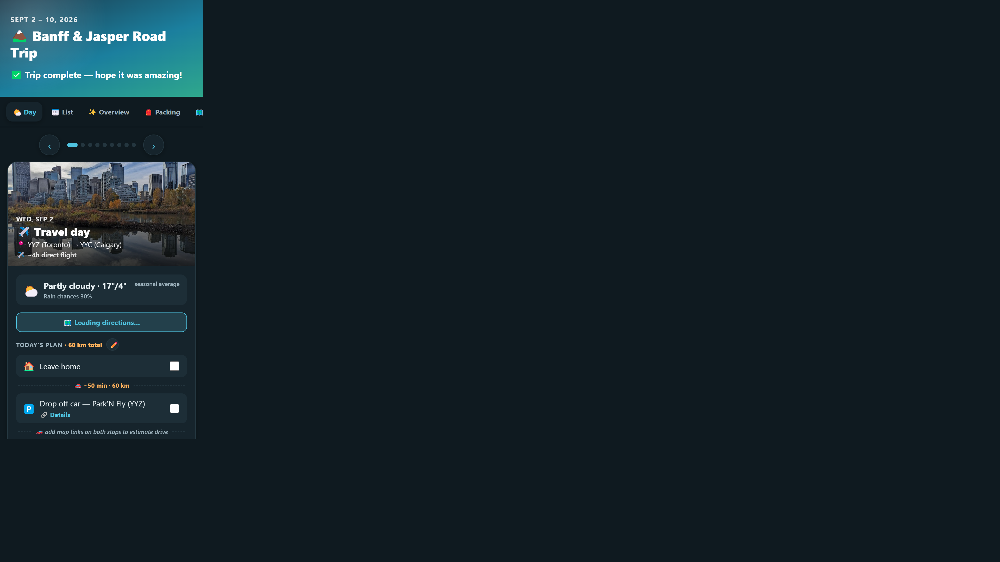 | 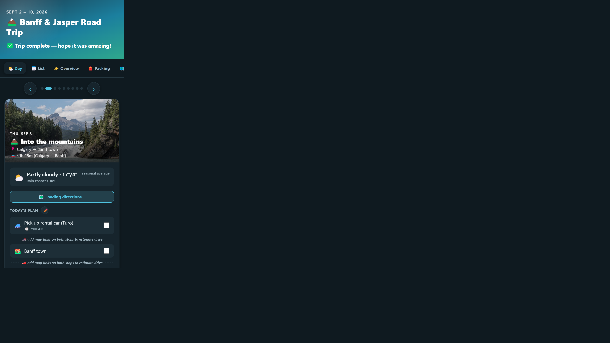 | 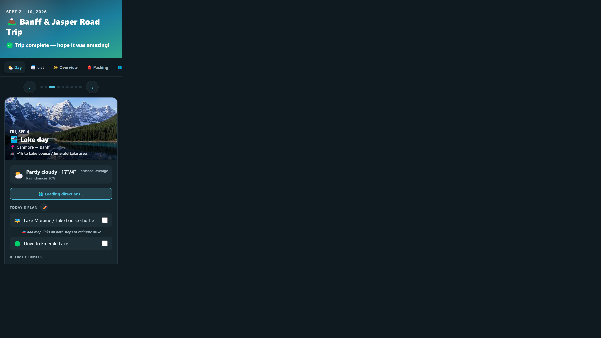 |

| Sep 5 · Icefields Parkway | Sep 6 · Jasper | Sep 7 · Columbia Icefield |
| --- | --- | --- |
| 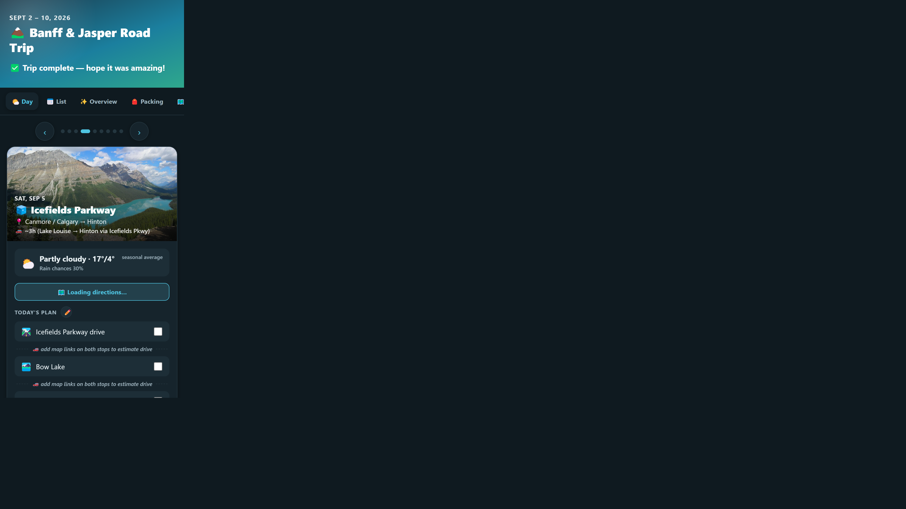 | 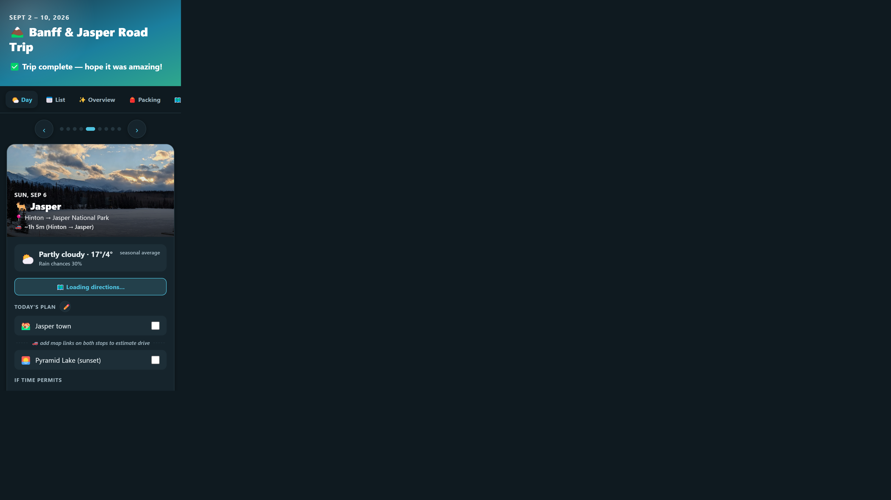 | 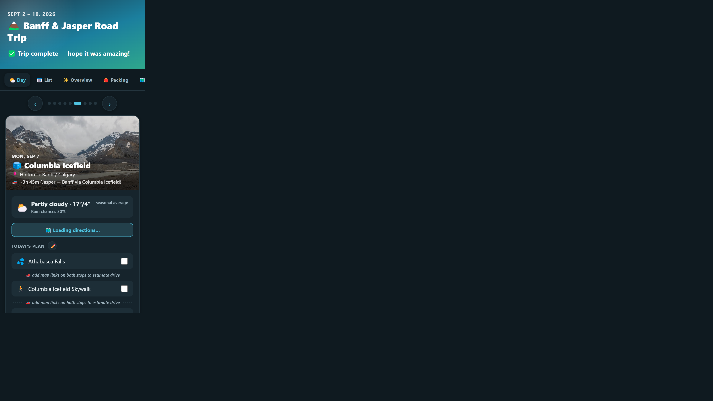 |

| Sep 8 · Kananaskis | Sep 9 · Calgary | Sep 10 · Fly home |
| --- | --- | --- |
| 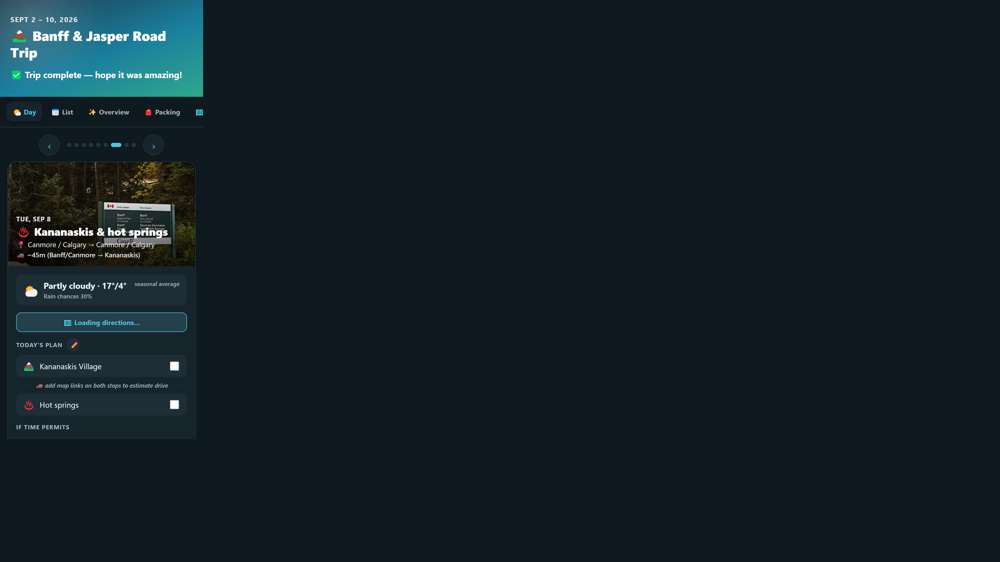 | 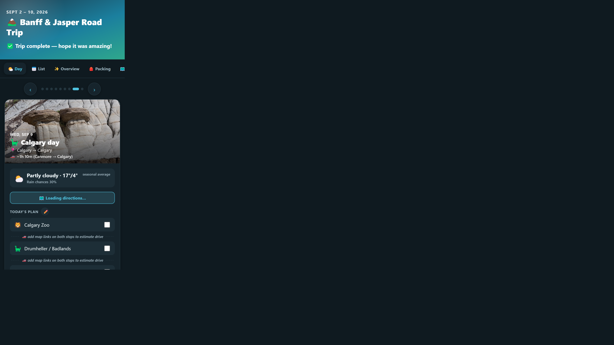 |  |

### Other pages

| List | Overview | Packing |
| --- | --- | --- |
|  | 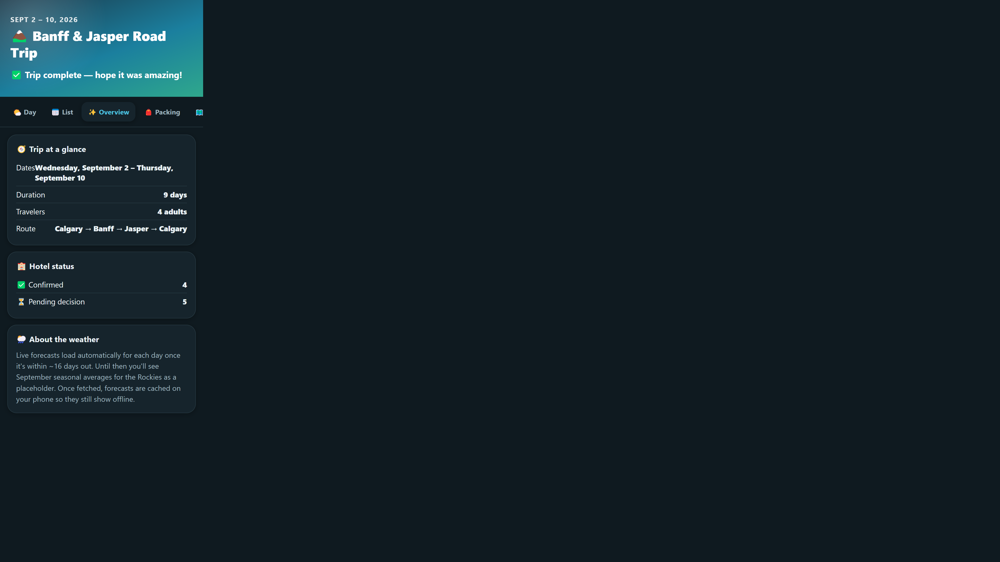 | 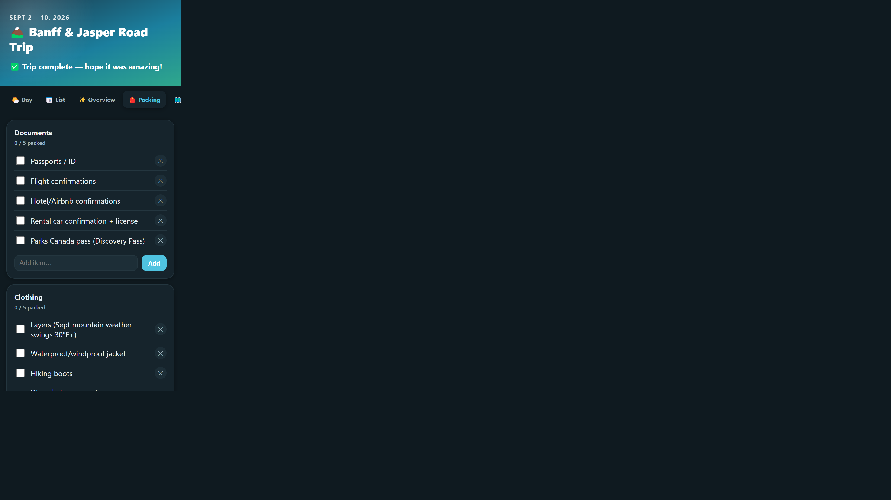 |

| Journey map | Satellite map |
| --- | --- |
| 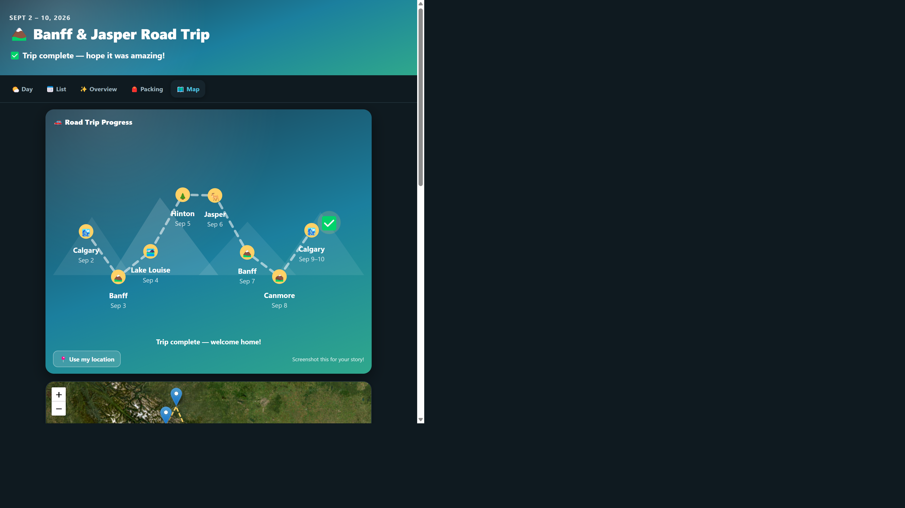 | 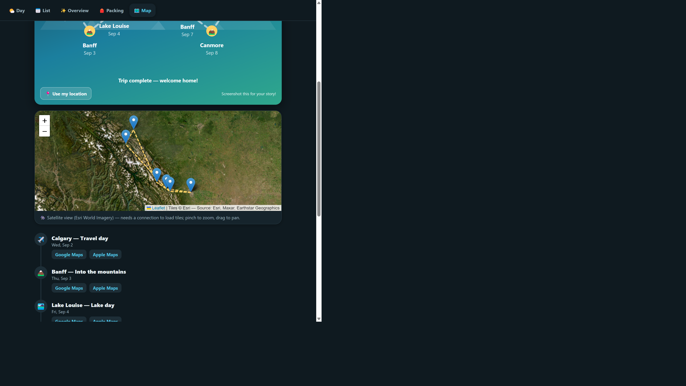 |

All captures also live under [`screenshots/`](screenshots/).

## Structure

- `index.html` — page shell
- `css/styles.css` — styling (light/dark auto)
- `js/data.js` — starting template (`TRIP_DEFAULTS`) for a fresh install / reset
- `js/store.js` — live data layer (`localStorage` + optional server sync)
- `js/sync.js` — push/pull trip JSON to the API
- `js/routing.js` / `server/routing.js` — drive-time estimates between mapped stops
- `js/weather.js` — live forecast via Open-Meteo (free, no API key), cached offline
- `js/app.js` — rendering, tabs, edit modal, day swipe, journey map
- `server/` — small Node API that persists `data/trip.json` and resolves map links
- `manifest.json` + `service-worker.js` — installable + offline
- `icons/` — app icons
- `images/` — trip photos (Wikimedia Commons), compressed for offline caching
- `vendor/leaflet/` — self-hosted Leaflet so the map works without a JS CDN
- `screenshots/` — UI captures for this README

## Features

- **Day view** — swipeable, one day per screen with hero photo, live weather, and activities
- **List view** — full itinerary, expandable per day
- **Edit mode** (pencil) — inline edit activities, stops, hotels, costs; saved to the device (and optionally synced)
- **Packing list** — categorized and checkable
- **Map** — Esri World Imagery via Leaflet (no API key), animated journey map, and Google/Apple Maps links
- **Optional sync** — Docker Compose runs nginx + a Node sidecar that writes trip edits to `data/trip.json`

## Run locally

### Static only

Serve the repo root with any static server (e.g. `npx serve .`). Edits stay in `localStorage`.

### Full stack (recommended for sync)

```bash
docker compose up -d --build
```

Then open `http://localhost:10450`.

## Deploying behind a reverse proxy

1. Clone the repo onto your host.
2. `docker compose up -d --build` — nginx on port `10450`, API sidecar writing to `./data`.
3. Point your reverse proxy (e.g. Nginx Proxy Manager) at that port and enable HTTPS (service workers need HTTPS or localhost).
4. After file changes, bump `CACHE_VERSION` in `service-worker.js` so clients pick up the new shell.

In-app edits are primarily in each browser’s `localStorage`. With the API up, they also persist to `data/trip.json` on the host.

## Resetting to defaults

Everything editable is keyed `banff_trip_v2` in `localStorage`. In the browser console:

```js
Store.resetToDefaults()
```

## Notes on weather

Forecasts are available ~16 days out (Open-Meteo). Farther out, days show a September Rockies seasonal-average placeholder.

## Privacy / public archive

Booking confirmation tokens, private photo-share URLs, license plates, and exact home/pickup street addresses were removed before publishing. Hotel names and public place links remain as part of the trip story. If you fork this, put your own private links in local edits — don’t commit them.
